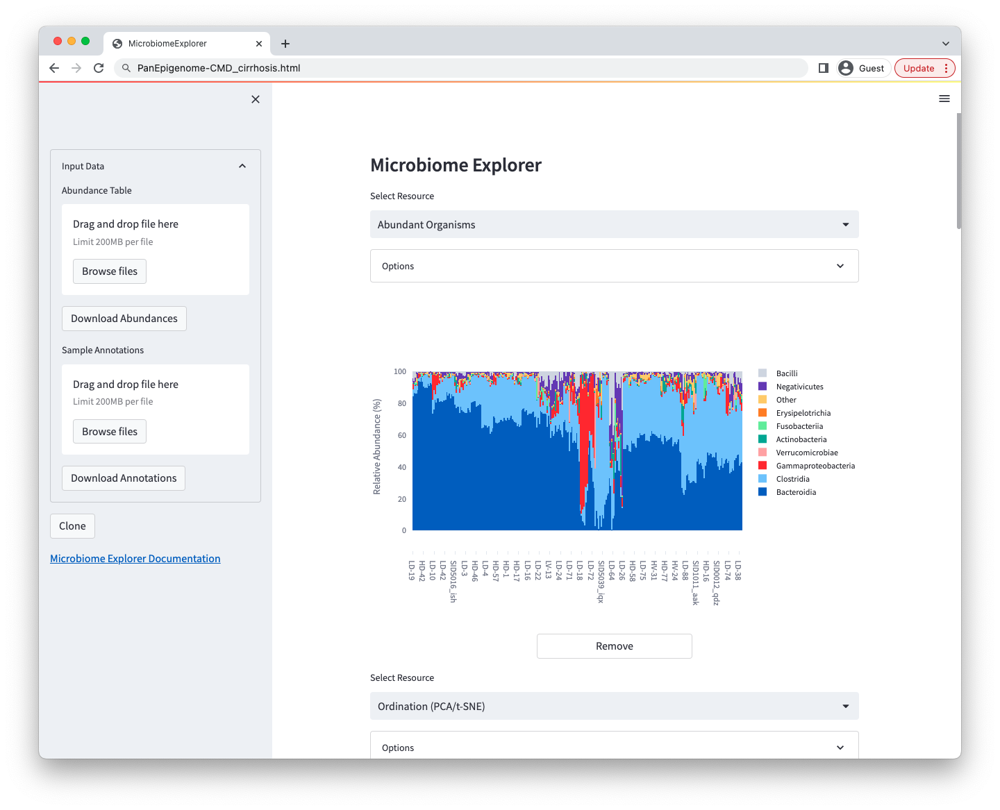
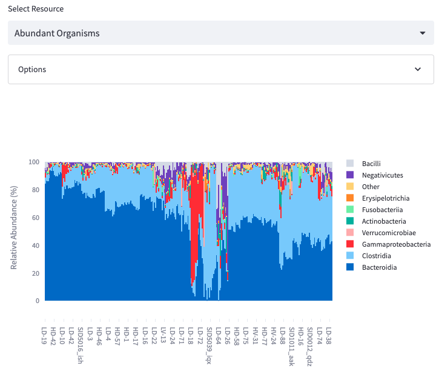
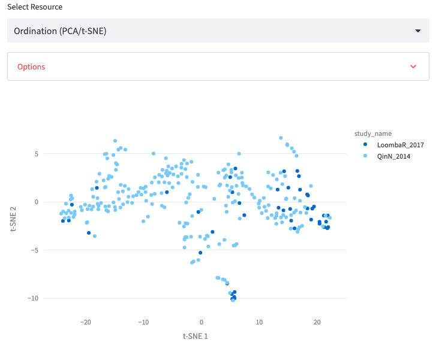
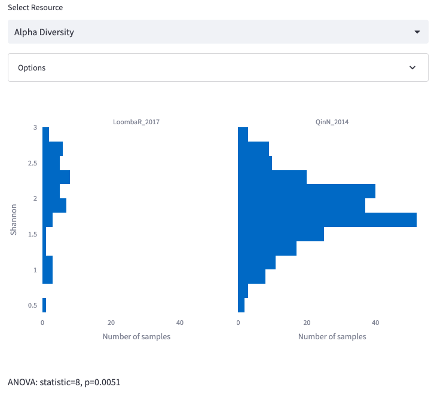
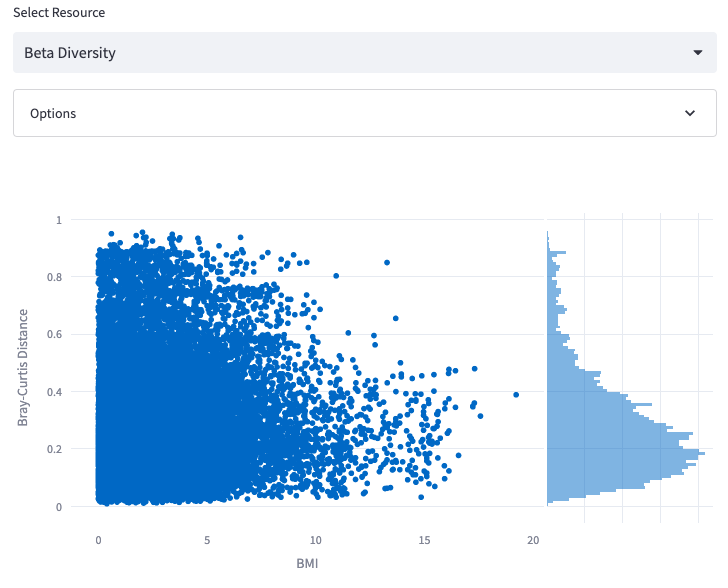
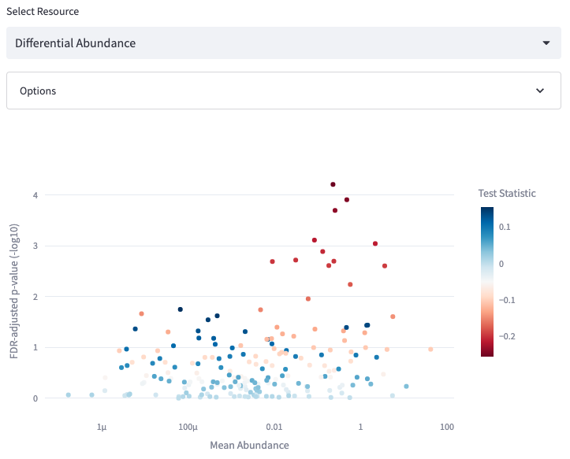
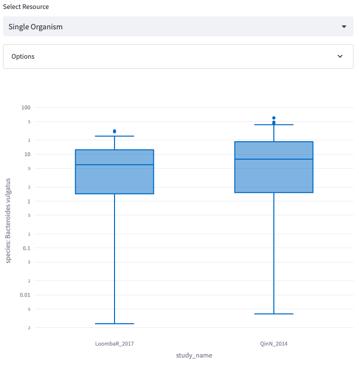
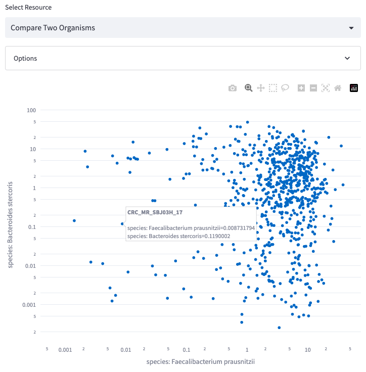

The world is filled with an incredible diversity of microbial life,
and one of the achievements of modern technology is the ability to
construct a rather accurate census of the collection of microbes
which are present in any particular physical specimen.  
The **Microbiome Explorer** is designed to provide a convenient
interface for comparing the collections of microbes which are present
across a group of samples.

### Example Datasets

All datasets were obtained from the amazing [curatedMetagenomicData](https://waldronlab.io/curatedMetagenomicData/)
project ([doi: 10.1038/nmeth.4468](https://doi.org/10.1038/nmeth.4468)).

| Disease                          | Browser                                  | Num. Studies | Num. Samples |
| -------                          | -------                                  | ------------ | ------------ |
| None                             | [link](MicrobiomeExplorer-base.html)           | N/A          | N/A          |
| Inflammatory Bowel Disease (IBD) | [link](MicrobiomeExplorer-CMD_IBD.html)        | 6            | 2,881        |
| Colorectal Cancer (CRC)          | [link](MicrobiomeExplorer-CMD_CRC.html)        | 11           | 1,395        |
| Cirrhosis                        | [link](MicrobiomeExplorer-CMD_cirrhosis.html)  | 2            | 282          |
| Type 1 Diabetes (T1D)            | [link](MicrobiomeExplorer-CMD_T1D.html)        | 3            | 214          |
| Shiga-toxigenic E. coli (STEC)   | [link](MicrobiomeExplorer-CMD_STEC.html)       | 1            | 42           |

### Input Data

To display a new dataset using the Microbiome Explorer simply format an abundance table
(and optional annotation table) in the format described below, and then upload
them to the blank Microbiome Explorer app provided above.  
Once the data has loaded, use the "Clone" button to save a copy of the updated app
as HTML.

**Input Data: Abundance Table**  
The microbial abundance values may be provided as either:

- Integer values indicating the number of reads assigned to each taxon, or
- Scalar (percentage or proportion) values indicating the fraction of the community predicted to consist of a particular taxon

The abundance table may be CSV or TSV, with support
for gzip-compression. The table must be oriented such
that each row contains information for a different
taxon and each column denotes a different sample.
The first row contains sample names and the first
column contains taxon names.
The format of taxon names is shown below, using a particular
format which includes each nested rank delimited with a
`|` or `;` character.
Any rows starting with `#` are ignored.

| |   SID0002_gti |   SID0004_cle |   SID0006_evh |   SID0008_kcu |   SID0009_rhg |
|:-----------------------------------------------------------------------------------------------------------------------------------------|--------------:|--------------:|--------------:|--------------:|--------------:|
| k__Bacteria\|p__Bacteroidetes\|c__Bacteroidia\|o__Bacteroidales\|f__Bacteroidaceae\|g__Bacteroides\|s__Bacteroides_vulgatus              |      16.2986  |      14.8991  |      20.1893  |       0.31815 |      20.1322  |
| k__Bacteria\|p__Bacteroidetes\|c__Bacteroidia\|o__Bacteroidales\|f__Bacteroidaceae\|g__Bacteroides\|s__Bacteroides_uniformis             |      10.4081  |      19.4103  |       2.9221  |       0.27528 |       4.07602 |
| k__Bacteria\|p__Bacteroidetes\|c__Bacteroidia\|o__Bacteroidales\|f__Bacteroidaceae\|g__Bacteroides\|s__Bacteroides_plebeius              |       9.71026 |       0       |       0       |       0       |       0       |
| k__Bacteria\|p__Firmicutes\|c__Clostridia\|o__Clostridiales\|f__Lachnospiraceae\|g__Lachnospiraceae_unclassified\|s__Eubacterium_rectale |       8.05587 |       0.02132 |       2.96656 |      16.8233  |       0.12402 |
| k__Bacteria\|p__Bacteroidetes\|c__Bacteroidia\|o__Bacteroidales\|f__Rikenellaceae\|g__Alistipes\|s__Alistipes_finegoldii                 |       6.7836  |       0       |       0       |       0.01673 |       0       |
| k__Bacteria\|p__Bacteroidetes\|c__Bacteroidia\|o__Bacteroidales\|f__Bacteroidaceae\|g__Bacteroides\|s__Bacteroides_caccae                |       6.53608 |       0       |       2.53602 |       0       |       0       |
| k__Bacteria\|p__Bacteroidetes\|c__Bacteroidia\|o__Bacteroidales\|f__Tannerellaceae\|g__Parabacteroides\|s__Parabacteroides_distasonis    |       5.59468 |       5.3551  |       2.10484 |       1.05405 |      12.0291  |
| k__Bacteria\|p__Firmicutes\|c__Bacilli\|o__Lactobacillales\|f__Streptococcaceae\|g__Streptococcus\|s__Streptococcus_salivarius           |       3.92924 |       0.00663 |       3.0444  |       1.17655 |       0.01676 |
| k__Bacteria\|p__Firmicutes\|c__Clostridia\|o__Clostridiales\|f__Eubacteriaceae\|g__Eubacterium\|s__Eubacterium_sp_CAG_180                |       3.40118 |       0       |       5.51812 |       0       |       0       |
| k__Bacteria\|p__Bacteroidetes\|c__Bacteroidia\|o__Bacteroidales\|f__Tannerellaceae\|g__Parabacteroides\|s__Parabacteroides_merdae        |       2.71169 |       0       |       1.40361 |       0.88862 |       0       |

**Input Data: Annotation Table**  
The annotation table has a much more flexible format.
Each row contains information for a different sample, and the first column
contains the sample identifier (matching the column names from the
abundance table). The first row must contain the header labels for each column.

|              | subject_id             | study_condition   | disease     | age_category   | NCBI_accession   | disease_subtype   |   disease_stage |
|:-------------|:-----------------------|:------------------|:------------|:---------------|:-----------------|:------------------|----------------:|
| SID0002_gti  | loombaSUB_subject-0002 | control           | fatty_liver | adult          | SRR5275484       | NAFLD             |               0 |
| SID0004_cle  | loombaSUB_subject-0004 | control           | fatty_liver | adult          | SRR5275483       | NAFLD             |               0 |
| SID0006_evh  | loombaSUB_subject-0006 | cirrhosis         | cirrhosis   | senior         | SRR5275481       | cirrhosis         |               4 |
| SID0008_kcu  | loombaSUB_subject-0008 | control           | fatty_liver | adult          | SRR5275480       | NAFLD             |               0 |
| SID0009_rhg  | loombaSUB_subject-0009 | control           | fatty_liver | adult          | SRR5275479       | NAFLD             |               0 |

### Analysis Features

The Microbiome Explorer can be used to display a number of different
types of analysis for a single dataset.
Use the `Add` and `Remove` buttons to modify the number of different
analyses which are displayed.
Any one of the individual displays may be modified using the menus
provided at the top of each section.

Every one of the different analysis types may be annotated with a
customized legend text, making it easy to describe the major findings
of each display to the reader.

#### Abundant Organisms  
Display the most abundant organisms as either a stacked bar chart
or a heatmap.

Options:  
- Plot Type: Stacked Bars or Heatmap
- Taxonomic Level: Class, Order, Family, etc.
- Filter Samples By: Only show those samples which match the metadata filter
- Color Samples By: Add a marginal color annotation indicating the value of one or more metadata annotations
- Max # of Organisms: Set the number of organisms displayed
- Sort Samples By: Optionally sort samples based on the provided metadata
- Heatmap Color Palette: Controls the colors used in the heatmap
- Annotation Color Palette: Controls the colors used in the marginal sample annotations
- Annotation Size: Controls the relative size of the marginal sample annotations
- Figure Height: Controls the height of the figure (width scales with the browser)
- Title: Add a title to the plot
- Legend: Add legend text below the plot

#### Ordination (PCA/t-SNE)  
Display a scatterplot representing the similarity of samples in terms
of beta-diversity using either PCA or t-SNE.

Options:  
- Ordination Type: PCA or t-SNE
- Taxonomic Level: Class, Order, Family, etc.
- Filter Samples By: Only show those samples which match the metadata filter
- Color Samples By: Add a color to each point indicating the value of one or more metadata annotations
- Show PCA Loadings: Optionally add a line to the PCA plots showing which organisms are associated with different principal coordinates
- 3D Plot: Optionally display a three-dimensional plot which can be rotated by the viewer (by clicking and dragging on the plot)
- Title: Add a title to the plot
- Legend: Add legend text below the plot

#### Alpha Diversity  
Display a histogram representing the complexity of samples in terms
of alpha-diversity using either Shannon or Simpson diversity.

Options:  
- Diversity Metric: Shannon or Simpson
- Taxonomic Level: Class, Order, Family, etc.
- Filter Samples By: Only show those samples which match the metadata filter
- Compare Samples By: For continuous values, show a scatterplot; for categorical values, show multiple histograms
- Number of bins: Controls the granularity of the histogram
- Figure Height: Controls the height of the figure (width scales with the browser)
- Title: Add a title to the plot
- Legend: Add legend text below the plot

#### Beta Diversity  
Display a histogram representing the similarity of samples in terms
of beta-diversity.

Options:  
- Diversity Metric: Bray-Curtis, Euclidean, or Jensen-Shannon
- Taxonomic Level: Class, Order, Family, etc.
- Filter Samples By: Only show those samples which match the metadata filter
- Compare Samples By: For continuous values, show a scatterplot; for categorical values, show multiple histograms
- Number of bins: Controls the granularity of the histogram
- Figure Height: Controls the height of the figure (width scales with the browser)
- Title: Add a title to the plot
- Legend: Add legend text below the plot

#### Differential Abundance  
Compare the abundance of individual organisms between samples
on the basis of a particular metadata annotation

Options:  
- Compare Samples By: Select the metadata category used to compare samples
- Filter Samples: Only use those samples which match the metadata filter
- Taxonomic Level: Class, Order, Family, etc.
- Figure Height: Controls the height of the figure (width scales with the browser)
- Title: Add a title to the plot
- Legend: Add legend text below the plot

#### Single Organism  
Show the relative abundance of a single organism across samples,
including categorical or continuous comparisons across samples

Options:  
- Organism: The organism to display
- Plot Type: Box or Scatter
- Compare Samples By: Select the metadata category used to compare samples
- Filter Samples: Only use those samples which match the metadata filter
- Log10 Scale: Optionally scale the vertical axis by log10
- Figure Height: Controls the height of the figure (width scales with the browser)
- Title: Add a title to the plot
- Legend: Add legend text below the plot

#### Compare Two Organisms  
Compare the relative abundance of two organisms across samples,
including categorical or continuous comparisons across samples

Options:  
- Organism 1 & 2: The organisms to display
- Color Samples By: Optionally annotate samples by metadata annotations
- Filter Samples: Only use those samples which match the metadata filter
- Log10 Scale: Optionally scale the axes by log10
- Figure Height: Controls the height of the figure (width scales with the browser)
- Title: Add a title to the plot
- Legend: Add legend text below the plot
