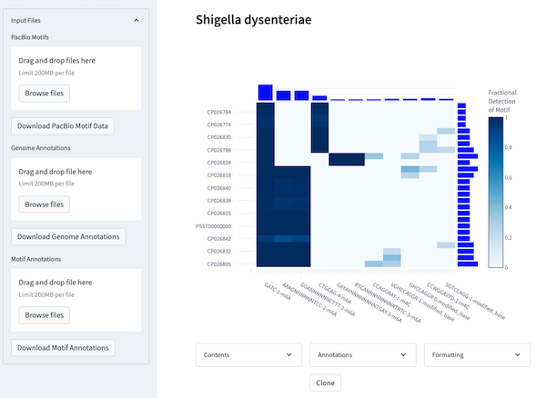

The incredible diversity of microbial life is not only driven by the different genes in their genomes,
but also by the chemical structure of the DNA which encodes those genes -- their "epigenome."  
The Pan-Epigenome Browser makes it easy to compare the epigenetic modifications from a group of
organisms, identifying important patterns to learn something new about the microbial world.

**Example Datasets**

| Organism | Browser | Data Files | Num. Genomes | Num. Motifs |
| -------- | ------- | ---------- | ------------ | ----------- |
| None | [link](PanEpigenome-base.html) | N/A | 0 | 0 |
| Shigella dysenteriae | [link](PanEpigenome-Shigella_dysenteriae.html) | [link](Shigella_dysenteriae.raw_data.zip) | 26 | 44 |
| Escherichia coli | [link](PanEpigenome-Escherichia_coli.html) | [link](Escherichia_coli.raw_data.zip) | 103 | 389 |
| Clostridioides difficile | [link](PanEpigenome-Clostridioides_difficile.html) | [link](Clostridioides_difficile.raw_data.zip) | 40 | 34 |
| Streptococcus equi subsp. equi | [link](PanEpigenome-Streptococcus_equi_subsp_equi.html) | [link](Streptococcus_equi_subsp_equi.raw_data.zip) | 35 | 20 |
| Klebsiella pneumoniae | [link](PanEpigenome-Klebsiella_pneumoniae.html) | [link](Klebsiella_pneumoniae.raw_data.zip) | 31 | 95 |

**Background**  
There are many different reasons why epigenetic modifications may be important for the biology
of a particular bacterial strain:

 - Defense from invading genetic elements (e.g. plasmids, phage)
 - Regulation of gene expression
 - Phase variation

The large amount of variation in bacterial epigenetics has become much better appreciated
with the advent of third-generation epigenome-aware platforms for genome sequencing.
The primary platform which provides epigenetic information is
[PacBio SMRT Sequencing](https://www.pacb.com/blog/steps-of-smrt-sequencing/), while
the Oxford Nanopore platform can also
[generate methylation information](https://nanoporetech.com/applications/investigation/epigenetics)

Some key characteristics of bacterial epigenetic modification are:

 - Chemical modifications are made to DNA in the context of short nucleotide **motifs** (e.g. GATC)
 - Each type of modification may occur at a **different molecular position** within the nucleotide
 - Different strains of the same species will often have a **distinct epigenetic profile** (collection of motifs)

**Input Data**  
The Pan-Epigenome Browser reads epigenome profiles which are produced by the PacBio analysis platform.
Specifically, the `motifs.csv` file produced by the
[`MotifMaker`](https://www.pacb.com/wp-content/uploads/SMRT_Tools_Reference_Guide_v11.0.pdf)
utility for each genome.
It is strongly recommended to name each of the motif CSV files according to their source to avoid
confusion (e.g. `EcoliK12.motifs.csv`).

**Public Data**  
The public NCBI data repository
[accepts PacBio base modification files](https://www.ncbi.nlm.nih.gov/genbank/basemodificationfiles/)
including the summary CSV format which is used by the Pan-Epigenome Browser.
A complete list of datasets which include these files can be found
[here](https://ftp.ncbi.nlm.nih.gov/pub/supplementary_data/basemodification.csv).
Within that table, any of the files with `BaseModification-MotifsSummary` listed
as their `File Type` should be compatible.
In addition, the BioProjects containing base modification data can be found using
the search term
["has basemodification"[Properties]](https://www.ncbi.nlm.nih.gov/bioproject/?term=%22has+basemodification%22%5BProperties%5D)

**Background Reading**

Wilbanks, E.G., Doré, H., Ashby, M.H. et al. **Metagenomic methylation patterns resolve bacterial genomes of unusual size and structural complexity.** ISME J 16, 1921–1931 (2022). [https://doi.org/10.1038/s41396-022-01242-7](https://www.nature.com/articles/s41396-022-01242-7)

> Fig. 1: Restriction-modification (RM) systems provide bacteria and archaea
> with a defense against foreign DNA by discriminating self from non-self DNA based on methylation patterns.  

